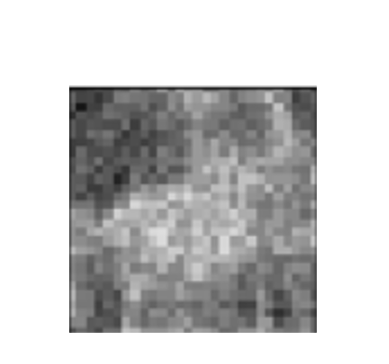
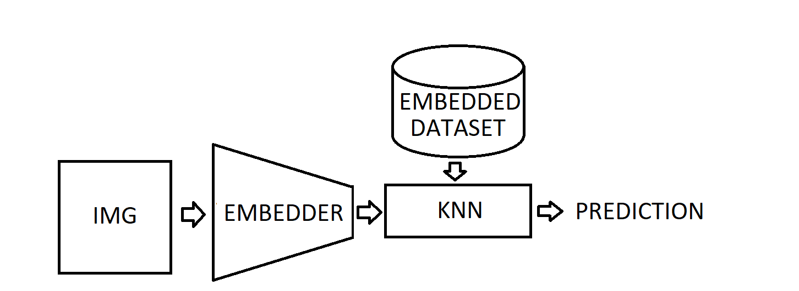
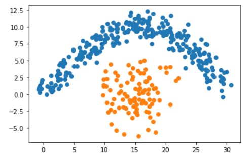
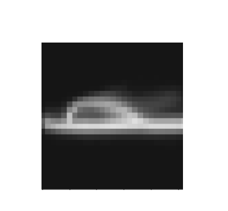
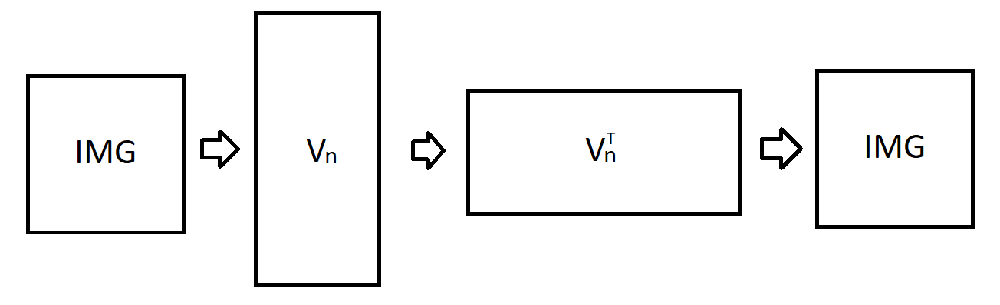
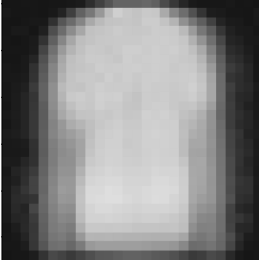
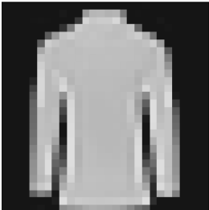
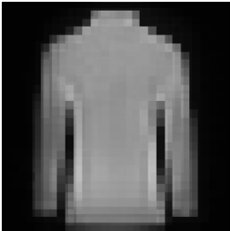
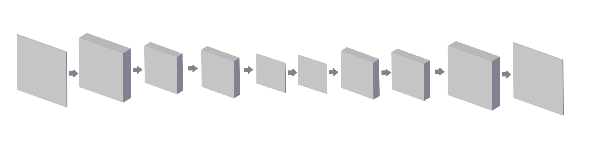
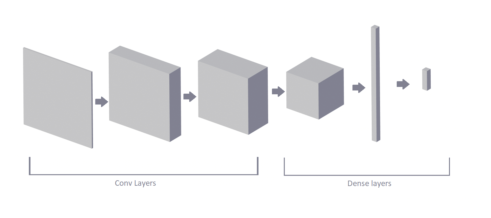

<div style="text-align: justify">

## Explainable Computer Vision with embedding and k-NN classifier

*Authors: Olaf Werner, Bogdan Jastrzębski (Warsaw University of Technology)*

### Abstract

Interpretability of machine learning models become in recent years even more important. The need for it raised a wave of criticism towards deep neural networks (DNNs), as they are not interpretable. However, DNN can give much better results than other classifiers for different tasks, e.g. image recognition, and therefore there is a trade-off between interpretability and robustness. In this work, we investigate further the idea of Deep k-Nearest Neighbors (DkNN), simplifying the previous algorithm. We present an easy augmentation technique of k-NN classifier, that can significantly boost its performance in image recognition using autoencoders or other unsupervised learning algorithms. We obtain classifier that is interpretable in a sense, that we can provide explanatory training set observations and in the same time much more robust. This technique, however, as presented here, produced worse results than a convolutional neural network, and therefore there is still a room for improvement.

---

### 3.8.1 Introduction

Artificial neural networks are widely used in computer vision. Convolutional neural networks [3], in particular, can achieve very high performance on this task and surpass other popular classifiers like SVM, logistic regression and decision trees. However, the increase in performance is associated with a loss of interpretability. Artificial neural networks are infamous for their complexity and lack of interpretability and are often criticized for it. 

K-nearest neighbors classifier (k-NN) one of the simplest classification algorithms, yet it is interpretable and highly complex. The idea behind it is simple. To predict the class of a new observation, e.g. an image, we calculate the measure of similarity between it and all observations in collected training data. Then we find an arbitrarily chosen number of the most similar observations. We base our prediction on their labels.

There are several problems with the k-NN. Its prediction depends on the choice of the mentioned measure of similarity. The optimal measure can be very complex and non-trivial. Let's take the problem of image recognition as our example. Two images that represent the same object on a different background can have the majority of the values of pixels different. A measure that treats each pixel independently, e.g. euclidean distance, would lead to an incorrect conclusion, that those images display very different objects. 
The second problem with the k-NN is that it scales poorly with the size of the training dataset, as every time we make a prediction, we must measure the similarity between a new observation and all observations in our training dataset, which can become very time-consuming. 

Interpretability of the k-NN classifier is in two things: interpretability of the measure of similarity we use and in that, with each prediction, we can provide the most similar observations from the training data set used to make the prediction. We argue that the latter is more important and that we can still call a model interpretable, if the measure of similarity is not. 

The idea is not new. It has been previously investigated by Nicolas Papernot and Patrick McDaniel from Pennsylvania State University [6]. In our approach, we simplify their algorithm. We propose to use data embedding techniques to produce more meaningful spaces, where the use of p-norms as similarity measures is more justified. In this article, we will show that it is possible to increase significantly the performance of the k-NN using this technique.

---

### 3.8.2  Data

We are going to use dataset [Fashion-Mnist](https://www.openml.org/d/40996). Fashion-MNIST is a dataset of Zalando's article images, consisting of a training set of 60,000 examples and a test set of 10,000 examples. Each example is a 28x28 grayscale image, associated with a label from 10 classes. Classes are following:

- T-shirt/top

- Trouser

- Pullover

- Dress

- Coat 

- Sandal

- Shirt

- Sneaker

- Bag

- Ankle boot.

---

### 3.8.3 Methodology

The simplest and one of the most robust classifiers is k-NN. It doesn't generalize information, instead, it saves training dataset and during prediction, it finds the most similar historical observations and predicts the label of a new observation based on their labels. However, it not only can't distinguish important features from not important ones but also to find more complex interactions between variables. 

One of the simplest, yet very robust classification algorithms is k-NN. It does not generalize knowledge, instead, it finds the most similar observations from the training data set to new observation and predicts its class based on theirs. However, it's not only unable to distinguish important from irrelevant features, but also find interactions between variables.

A way to improve classification results with the k-NN algorithm is to determine a better measure of similarity than the p-norm. In this paper, we propose a measure of similarity of the following form:

$$ dist(x,y) := \| Emb(x) - Emb(y) \|_p $$

where $Emb: \mathbb{R}^n \rightarrow \mathbb{R}^m$, $\mathbb{R}^n$ is the space of observations and $\mathbb{R}^m$ is the space of embedding (n > m).
Note, that $dist$ is not a metric.

An embedding can be done made in various ways. In this article we will explore different embedding techniques, including:

* SVD embedding

* Convolutional Autoencoder

* K-means embedding

---

### 3.8.4 Autoenconders and Embedding

An embedding 

An autoencoder consists of two parts, the encoder and the decoder, which can be defined as functions $Encoder: \mathbb{R}^n \rightarrow \mathbb{R}^m$ and $Decoder: \mathbb{R}^m \rightarrow \mathbb{R}^n$ where $n>m$.
We want our autoencoder to be such that: $min_\theta \sum_{i=1}^{n}\|(Decoder_\theta \circ Encoder_\theta)(x_i)-x_i \|$. It basically means that after using encoder and decoder our data is minimally changed.

Thanks to using encoder we can compress data to smaller space without losing too much information. Because of smaller space every column is now more meaningful and therefore data is easier for k-NN.
    


### 3.8.4 The use of standard intepretable models in computer vision

We often think of logistic regression or decision tree classifier as being interpretable. Their interpretability, however, relies strongly on the interpretability of observation features.  When features are hardly interpretable, the information that a particular feature has been used is meaningless. For instance, if we know, that at some point classifier makes a choice based on the age of the patient, it is a piece of meaningful information.  On the other hand, if we know, that at some point classifier makes a choice based on one of a million pixels, this information might be meaningless to us. It gives very little explanation, why a particular pixel has been used. 

Interpretability of decision tree classifier or linear regression comes directly from 

In this section we will explore use of standard interpretable models and we will try to argue, that they are not useful when it comes to computer vision.

---

#### 3.8.4.1 Logistic Regression

Logistic regression[1] is a basic classification model. We get the probability of belonging to a given class by:

$${\displaystyle p={\frac {e^{\beta _{0}+\beta _{1}x_{1}+...+\beta _{n}x_{n}}}{e^{\beta _{0}+\beta _{1}x_{1}+...+\beta _{n}x_{n}}+1}}}$$

where $\beta _{0},\beta _{1},...,\beta _{n}$ are coefficients of logistic regression. We obtain coefficients using gradient descent. Because we have multiple labels so we train 10 different logistic regression models and use softmax function to normalize probabilities of belonging to any particular class. 
We then visualize coefficients as images with bright spots indicating that they are important.
Unfortunately the results look like this:



We get this because logistic regression works more like a sieve.

---

#### 3.8.4.2 Decision Trees

Decision trees are very useful classifiers that can be interpreted, however they are suitable when we have very few meaningful dimensions. The tree that at a time makes a choice based on individual pixels is not a good classifier and it's explanation provides little knowledge about, why the selected pixels has been chosen. Therefore, we will not examine the use of this class of classifiers.

---

### 3.8.5 Our Approach

In this section we will show an alternative to logistic regression and decision trees, that is more interpretable and at the same time can obtain significantly better results.

---

#### 3.8.5.1 The k-NN Classifier

k-NN (k nearest neighbors) is a classifier, that doesn't generalize data. Instead, we keep the training dataset, and every time we make a prediction, we calculate the distance (for instance euclidean distance) between our new observation and all observations in the training dataset to find k nearest. Prediction is based on their labels. 

k-NN is a robust classifier, that copes with highly nonlinear data. It's also interpretable because we can always show k nearest neighbors, which are an explanation by themselves. It, however, is not flawless. It for instance poorly scales with the size of the training dataset, while at the same time it needs, at least in some domains, a very big training dataset, as it doesn't generalize any information. 

We can significantly improve its performance by introducing complex similarity functions. If the similarity function is interpretable, we obtain a highly interpretable classifier. If not, we get semi interpretable classifier, where we cannot tell, why observations are similar according to the model, however, we can at least show similar training set examples, based on which prediction has been made.

This complex distance functions can be made in many different ways. In this paper, we explore functions of a form

$$dist(Img1, Img2) = d_e(Emb(Img1), Emb(Img2))$$
where $d_e$ is the euclidean distance, so we simply compute the euclidean distance between embeddings of images. The scheme of our augmented k-NN classifier is displayed on fig. 1.




As we can see, new image firstly gets embedded and then a standard classification with k-NN is made. This type of architecture allows us to create a robust and interpretable classifier.

---

#### 3.8.5.2 Embedding techniques

In this section, we will explore different embedding techniques.

---

##### 3.8.5.2.1 K-means

We use K-means algorithm [2] (also known as Lloyd algorithm) to find subclasses in every class. 
Algorithm:

1. Initiate number of random centroids

2. For every observation find nearest centroid

3. Calculate average of observations in every group found in point 2

4. This averages becomes new centroids

5. Repeat points 2 to 4 until all new centroids are at the distance less then $\epsilon$ from old centroids

We use euclidean distance. Prediction for every new observation is simply class of nearest centroid. The algorithm is even more interpretable because we can visualize centroids as images. Thanks to using K-means to find subclasses our images are not blurry. Also because the number of all subclasses is much lower than the number of records in data set using k-NN only on centroids is much faster. Consider the following dataset:



In fact, a good subset of the training data set is enough to create a very good classifier. For instance we can choose:


Chosen points approximate sufficiently training data distribution. Notice, that we in fact don't have to choose particular observations. We can instead chose points in observation space that are similar to observations. This is what k-means algorithm do and so, we can obtain good training data approximation using k-means. Here's an example of a centroid image:



---

##### 3.8.5.2.2 SVD

SVD is a standard method of dimensionality reduction [4]. It is rewriting $m\times n$ matrix 
$M$ as $U\Sigma V^T$ where $U$ is $m\times m$ orthonormal matrix, $V^T$ is $n\times n$ orthonormal matrix 
and $\Sigma$ is $m\times n$ rectangular diagonal matrix with non-negative real numbers on the diagonal.
We assume that singular values of $\Sigma$ are in descending order. Now by taking first columns of $V^T$ we 
get vectors which are the most relevant. Let $V_n$ be matrix, whose columns are $V$ columns with n greatest eigenvalues. Such matrix is linear transformation matrix, that turns observations into their embedding. It can be shown, that $V_n$ is the best transformation in L2 norm sense.


We can then visualize this vectors and see which parts of the picture are the most important. 
Also we can reduce number of dimensions for k-NN.







---

##### 3.8.5.2.3 Convolutional Autoencoder

We can create semi interpretable model by training a convolutional autoencoder and then creating k-NN classifier on pretrained embedding. As mentioned previously, it has several advantages over k-NN, because it uses euclidean distance in more meaningful space. Embedder is not interpretable, but our classifier can at least show us historical observations, that had an impact on prediction, which sometimes is good enough, especially when it can be easily seen why two images are similar and we only want a computer to do humans work. For instance, if we provide 5 images of shoe that caused that our image of shoe has been interpreted as shoe, we maybe don't know, why those images are similar according to our classifier, however we can see, that they are similar, so further explanation of a model is not required. This model, again, is not fully interpretable.

Our implementation of convolutional autoencoder consist of the following layers:

- Conv2d:
    - Input Channels:  1
    - Output Channels: 50
    - filter size: 5

- Conv2d:
    - Input Channels: 50
    - Output Channels: 50
    - filter size: 5

- Conv2d:
    - Input Channels: 50
    - Output Channels: 10
    - filter size: 5

- Conv2d:
    - Input Channels: 10
    - Output Channels: 10
    - filter size: 5

- Conv2d:
    - Input Channels: 10
    - Output Channels:  1
    - filter size: 5

- Conv2d: 
    - Input Channels:  1
    - Output Channels: 10
    - filter size: 5

- Conv2d: 
    - Input Channels: 10
    - Output Channels: 10
    - filter size: 5

- Conv2d: 
    - Input Channels: 10
    - Output Channels: 50
    - filter size: 5

- Conv2d: 
    - Input Channels: 50
    - Output Channels: 50
    - filter size: 5

- Conv2d: 
    - Input Channels: 50
    - Output Channels:  1
    - filter size: 5

along with pooling and unpooling between.



---

### 3.8.6 Black-Box Convolutional Neural Networks


Classical approach in computer vision is to use convolutional neural networks [3].
A standard artificial neural network sees all variables as being independent 
from each other. It doesn't capture the same patterns across image space, nor
it recognizes, that two pixels next to each other are somehow related. Shifted 
image is something completely different to a standard neural network from it's original.
Therefore, training a standard neural network is tricky, it requires very big dataset
and takes a lot of time. There is, however, a smarter approach that has a capacity
to cope with those problems. Namely, convolutional neural networks.


A convolutional neural network is an artificial neural network, that tries to capture spacial dependencies between variables, for instance dimensions of pixels that are close to each other.
It does that via introducing convolution. The easiest interpretation of convolutional neural network is that instead of training training big network that uses all variables (in our case all pixels), we train smaller transformation with smaller number of variables (smaller subset of pixels close to each other), that we use in many different places on the image. In some sense we train filters. Every filter produces a corresponding so called "channel". After first layer we can continue filtering channels using convolutional layers. We place a dense layer (or a number of them) at the end and it's result is our prediction. For further reading, please see [3] .

Having a very good performance, they are impossible to explain. There are some techniques of visualizing filters, however more complex networks are generally uninterpretable. Along with standard artificial neural network, we will use it as an instance of robust classifier for comparing results. 
Our implementation of convolutional neural networks consist of the following layers:

- Conv 2d:
    - Input Channels: 1
    - Output Channels: 50
    - filter size: 5
    
- Max Pool:
    - Size: 2
    
- Conv 2d:
    - Input Channels: 50
    - Output Channels: 70
    - filter size: 5
    
- Max Pool:
    - Size: 2
    
- Conv 2d:
    - Input Channels: 70
    - Output Channels: 100
    - filter size: 5

- Max Pool:
    - Size: 2

- Conv 2d:
    - Input Channels: 100
    - Output Channels: 150
    - filter size: 5

- Linear: 
    - Input_size: 1350
    - Output_size: 500

- Linear: 
    - Input_size: 200
    - Output_size: 10

Here's architecture's visualization:


---

### Results

| Model  | ACC |
|-------|-----|
| Black-Box Convolutional | 0.941 | 
| Logistic regression | 0.847 | 
| k-NN base | 0.8606    | 
| k-NN SVD | 0.8001 |
| k-NN K-means | 0.8512 |
| k-NN Convolutional | 0.902 |

```{r}
library(ggplot2)

ggplot()+geom_col(aes(x=c("Conv Net","Logistic regression","k-NN base","k-NN SVD","k-NN K-means","k-NN Convolutional"),
                      y=c(0.941,0.847,0.8606,0.8001,0.8512,0.902)))+theme(axis.text.x =element_text(angle = 0,face = "bold"))+labs(x="model",y="Accuracy")
```

We use accuracy because classes are balanced and any measure which for accounts for similarities between classes (for example classifying Sandal as Ankle boot is worth more than classifying Sandal as Bag) seemed arbitraly to us.

As expected Convolutional Neural Network is by far the best model here. However we still achieved something. While using emmbedders such as K-means and SVD resulted in worse results, the accuracy was not that much worse and we reduced dimensionality at least thousand folds, which resulted in much faster calculations. Using Convolutional emmbedder got us second best results and while it is semi interpretable it is still better than base K-NN and Logistic regression which turned out to be not interpretable.


### Conclusions
In this article we proposed easy way of getting interpretable computer vision using convolutional emmbedder. While it is not fully interpretable, explainations are not made post factum as in traditional neural networks and it is achieving better results than less robust classifiers.

It maybe possible to get even better results if we carefully search hyperparameter space: for example tested more architectures of convolutional autoencoder and distance functions.


### Bibliography

1. Park, Hyeoun-Ae. "An Introduction to Logistic Regression: From Basic Concepts to Interpretation with Particular Attention to Nursing Domain", College of Nursing and System Biomedical Informatics National Core Research Center, Seoul National University, Seoul, Korea, 2013. Accessed at https://pdfs.semanticscholar.org/3305/2b1d2363aee3ad290612109dcea0aed2a89e.pdf?fbclid=IwAR2AEWs_oTJsGldDkTNdu5oDuwqMRG9URpYFTYg4ONEdxUSTbXS2AntHLNM
2. Huda Hamdan Ali, Lubna Emad Kadhum. "K-Means Clustering Algorithm Applications in Data Mining and Pattern Recognition", International Journal of Science and Research (IJSR), 2015. Accessed at https://pdfs.semanticscholar.org/a430/da239982e691638b7193ac1947da8d0d241b.pdf?fbclid=IwAR33LLbo0m9qcyayoI3qj1tJsnB8YzYehzFK7VUGz4tkH_IlATvhknPKOuk
3. Keiron O’Shea1, Ryan Nash. "An Introduction to Convolutional Neural Networks", Department of Computer Science, Aberystwyth University, Ceredigion, SY23 3DB, 2015. Accessed at https://www.researchgate.net/publication/285164623_An_Introduction_to_Convolutional_Neural_Networks?fbclid=IwAR35OQjrXNAm5549CX0-LkkdjppnNZIlnKfnFkHUcHsUZ_G-wdYDZ0v6SVY
4. Carla D. Martin, Mason A. Porter. "The Extraordinary SVD". Accessed at https://people.maths.ox.ac.uk/porterm/papers/s4.pdf?fbclid=IwAR2rC7ho-hLqtyR0eY5KqlYV_DbaKk7KcyE9PtT4hx1MkbXtnG04fe71uEo
5. Gongde Guo, Hui Wang , David Bell , Yaxin Bi , Kieran Greer. "KNN Model-Based Approach in Classification", School of Computing and Mathematics, University of Ulster. Accessed at http://citeseerx.ist.psu.edu/viewdoc/download?doi=10.1.1.2.815&rep=rep1&type=pdf&fbclid=IwAR0qK9dIhhmuj4-0V98Tn6dKzjKvivmfmucJVjDqV319eW_BJfWkt92Cy5E
6. Nicolas Papernot, Patrick McDaniel. "Deep k-Nearest Neighbors: Towards Confident,Interpretable and Robust Deep Learning", Department of Computer Science and Engineering, Pennsylvania State University, 2018. Accessed at https://arxiv.org/pdf/1803.04765.pdf?fbclid=IwAR2D5gqQf9SL0xRWBctEVrUCL9uUiIf9lZrpPN83YZYbiCGdLAlMlhhaVns


            