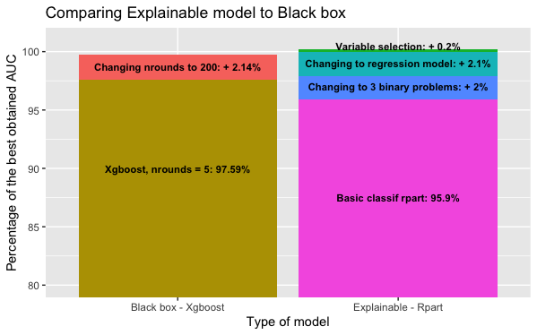

```{r setup, include=FALSE}
knitr::opts_chunk$set(echo = FALSE)
```

## Introduction

This presentation is based on work ***Building an explainable model for ordinal classification. Meeting black box model performance levels*** by: **Karol Saputa, Małgorzata Wachulec, Aleksandra Wichrowska**


## Ordinal Regression

In the classification problems, the main goal is to map inputs to a categorical target variable. Most machine learning algorithms assume that the class attribute is unordered. However, there are many problems where target variable is ranked, for example while predicting movie ratings. When applying standard methods to such problems, we lose some informaton, which could improve our model performance.

## Dataset

Experiments are based on 'eucalyptus' dataset from OpenML. The dataset's objective is to find the best seedlot for soil conservation in seasonally dry hill country. Predictions are made depending on features such as height, diameter and survival of the plants. Target variable is ordered - it is represented by values 'low', 'average', 'good' and 'best'.

## Ordinal classification as a regression

One of the most fundamental techniques is to cast target labels to a sequence of numbers. Then, a standard regression can be applied. There is an additional information about the classes in comparison to usual nominal classification. Metric used is different than in a classification task - mean square error used in a regression task takes into account similarities between two labels when conversion is applied. 

## Preprocessing

1. split data to 70% train and 30% test balanced with respect to proportion of classes

2. delete the observations with ‘none’ value in the target variable from both the training set and the test set

3. delete observations with missing values from test set, resulting in a 6% decrease of the test set observations

Missing values are deleted because some explanaition techniques and models don't work with missing values and to ensure that test dataset is same for all models.

## Initial Models

For black box model for comparison Xgboost was chosen because it gives great results in Kaggle competitions and Rpart because it is explainable.

## Improving the explainable model 

If the new change has improved the model’s performance on the test set then it became the base for further development. Instead, if it has not improved the model performance, the previous version of the model was being further developed.

## Improving the explainable model pt. 1 

Splitting a multiclass classification problem into 3 binary classification problems

## Improving the explainable model pt. 2

Changing the levels of the target variable:"low", "average", "good", "best" into numeric values: 1, 2, 3, 4, respectively and running a regression rpart model

## Improving the explainable model pt. 3

Imputing missing data in the training set

## Improving the explainable model pt. 4

Selecting variables: deleting the site names and specific location tags

This step has a scientific justification.
So far our model was making the prediction based also on specific flat map coordinates and site names, that are present both in the training and the test set. This means it would be impossible to use this model for judging seedlots of eucalypti planted outside of New Zealand.

## Improving the explainable model pt. 5

Transforming Latitude variable from factor to numeric

## Improvements of models



## Results for Explainable models pt.1

| Model  | AUC | MSE | ACC | ACC1| Percent Best AUC | 
|-------|---|---|---|---|-----|
| Basic rpart | 0.8259145 | 0.5284076 | 0.5835207 | 0.9797400 | 95,89% | 
| Three binary rparts | 0.8430115 | 0.5392606 | 0.5816277 | 0.9826626 | 97,88% |
| Regression rpart | 0.86115629	| 0.4994688 |	0.5814851	| 0.93207583 |	99,99% | 
| Regression rpart  with imputation| 0.8597930 |	0.5038168 |	0.5798347 |	0.9306883 |	99,83% |


## Results for Explainable models pt.2

| Model  | AUC | MSE | ACC | ACC1| Percent Best AUC | 
|-------|---|---|---|---|-----|
| Regression rpart  with no location | 0.8612852 |	0.4995913	| 0.5815428 |	0.9323226 |	100,00% |
| Regression rpart  with no location and numeric lattitide| 0.8612474 | 0.4993377 |	0.5816065 |	0.9322628 |	100,00% |

## Results for Black box models and the best Explainable model 

| Model  | AUC | MSE | ACC | ACC1| Percent Best AUC | 
|-------|---|---|---|---|-----|
| Xgboost | 0.8589771 | 0.4466546 | 0.6247675 | 0.9873244 | 99.73% |
| Xgboost with nrounds=5 | 0.8405102 | 0.4997935 | 0.6043936 | 0.9830193 | 97,59% | 
| Regression rpart  with no location and numeric lattitide| 0.8612474 | 0.4993377 |	0.5816065 |	0.9322628 |	100,00% |

## The End 
Thank You for your attention!


